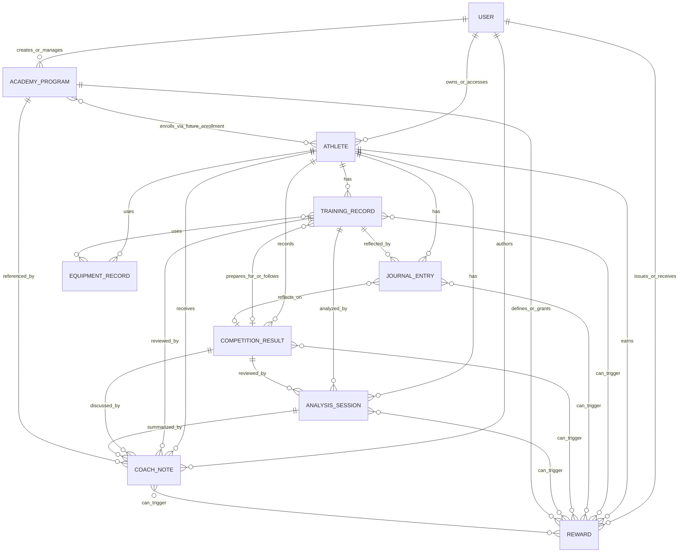

# SkatingX Platform Entity Relationship Diagram

## Goal

Show how SkatingX Platform v1 entities connect across User, Athlete, Training, Journal, Equipment, Competition, Analysis, Coaching, Academy, and Rewards.

This document is architecture documentation only. It does not define application code, Firestore security rules, or migration scripts.

## High-Level Relationship Map



## Canonical Firestore Tree

```text
users/{uid}
users/{uid}/athletes/{athleteId}
users/{uid}/athletes/{athleteId}/trainingRecords/{recordId}
users/{uid}/athletes/{athleteId}/journalEntries/{entryId}
users/{uid}/athletes/{athleteId}/equipmentRecords/{equipmentId}
users/{uid}/athletes/{athleteId}/competitionResults/{competitionId}
users/{uid}/athletes/{athleteId}/analysisSessions/{sessionId}
users/{uid}/athletes/{athleteId}/coachNotes/{noteId}
users/{uid}/athletes/{athleteId}/rewards/{rewardId}

academyPrograms/{programId}
rewardDefinitions/{rewardDefinitionId}
```

Future expansion paths:

```text
users/{uid}/athletes/{athleteId}/academyEnrollments/{enrollmentId}
users/{uid}/athletes/{athleteId}/analysisSessions/{sessionId}/artifacts/{artifactId}
organizations/{organizationId}
organizations/{organizationId}/members/{uid}
organizations/{organizationId}/athletes/{athleteId}
organizations/{organizationId}/academyPrograms/{programId}
```

## Entity Anchors

### User as Identity Anchor

`User` maps to Firebase Auth. It owns or can access athlete data, authors records, issues coach notes or rewards, and can manage academy content.

Important rule:

- Do not treat `User` as the skater by default. A parent or coach account may manage many athletes.

### Athlete as Domain Anchor

`Athlete` is the center of the sport data graph. Training, journal, equipment, competition, analysis, coach notes, and rewards are athlete-scoped child records.

Important rule:

- Do not store unbounded history inside the athlete document. Use subcollections and keep only dashboard summaries in `Athlete.summary`.

## Relationship Detail

| Source | Target | Cardinality | Relationship Field Direction |
| --- | --- | --- | --- |
| `User` | `Athlete` | One user to many athletes | `Athlete.ownerUid`, `Athlete.access.members[].uid` |
| `User` | `TrainingRecord` | One user to many records | `TrainingRecord.ownerUid`, `createdByUid`, `updatedByUid` |
| `User` | `JournalEntry` | One user to many entries | `JournalEntry.ownerUid`, `createdByUid`, `updatedByUid` |
| `User` | `EquipmentRecord` | One user to many records | `EquipmentRecord.ownerUid`, `createdByUid`, `updatedByUid` |
| `User` | `CompetitionResult` | One user to many results | `CompetitionResult.ownerUid`, `createdByUid`, `updatedByUid` |
| `User` | `AnalysisSession` | One user to many sessions | `AnalysisSession.ownerUid`, `createdByUid`, `updatedByUid` |
| `User` | `CoachNote` | One coach/admin to many notes | `CoachNote.coachUid`, `createdByUid` |
| `User` | `Reward` | One user/system to many awards | `Reward.issuedByUid`, `ownerUid` |
| `User` | `AcademyProgram` | One coach/admin to many programs | `AcademyProgram.coachUid` or future organization membership |
| `Athlete` | `TrainingRecord` | One athlete to many records | `TrainingRecord.athleteId` |
| `Athlete` | `JournalEntry` | One athlete to many entries | `JournalEntry.athleteId` |
| `Athlete` | `EquipmentRecord` | One athlete to many records | `EquipmentRecord.athleteId` |
| `Athlete` | `CompetitionResult` | One athlete to many results | `CompetitionResult.athleteId` |
| `Athlete` | `AnalysisSession` | One athlete to many sessions | `AnalysisSession.athleteId` |
| `Athlete` | `CoachNote` | One athlete to many notes | `CoachNote.athleteId` |
| `Athlete` | `Reward` | One athlete to many awards | `Reward.athleteId` |
| `TrainingRecord` | `EquipmentRecord` | Many training records to many equipment records | `TrainingRecord.relatedEquipmentIds[]` |
| `TrainingRecord` | `CompetitionResult` | Many training records to one optional competition | `TrainingRecord.relatedCompetitionId`, `CompetitionResult.relatedTrainingRecordIds[]` |
| `TrainingRecord` | `JournalEntry` | One training record to many reflections | `JournalEntry.relatedTrainingRecordId` |
| `TrainingRecord` | `AnalysisSession` | One training record to many analyses | `AnalysisSession.relatedTrainingRecordId` |
| `TrainingRecord` | `CoachNote` | One training record to many coach notes | `CoachNote.relatedTrainingRecordId` |
| `JournalEntry` | `CompetitionResult` | Many entries to one optional competition | `JournalEntry.relatedCompetitionId` |
| `CompetitionResult` | `AnalysisSession` | One competition result to many analyses | `AnalysisSession.relatedCompetitionId`, `CompetitionResult.relatedAnalysisSessionIds[]` |
| `CompetitionResult` | `CoachNote` | One competition result to many coach notes | `CoachNote.relatedCompetitionId` |
| `AnalysisSession` | `CoachNote` | One analysis session to many coach notes | `CoachNote.relatedAnalysisSessionId` |
| `AcademyProgram` | `Athlete` | Many programs to many athletes | Future `academyEnrollments` collection |
| `AcademyProgram` | `CoachNote` | One program to many coach notes | `CoachNote.relatedAcademyProgramId` |
| `AcademyProgram` | `Reward` | One program to many rewards | `Reward.relatedAcademyProgramId`, `AcademyProgram.rewardIds[]` |
| `Reward` | Activity records | Many rewards to many triggers | `Reward.relatedTrainingRecordIds[]`, `relatedJournalEntryIds[]`, `relatedCompetitionId`, `relatedAnalysisSessionId` |

## Firestore Cost and Query Notes

- Most product screens should start from `users/{uid}/athletes/{athleteId}` and read one child collection at a time.
- Athlete dashboards should use `Athlete.summary` for latest timestamps and counts instead of reading all child collections.
- Cross-athlete dashboards can use collection group queries by `ownerUid`, `athleteId`, and date fields, but should be deliberate and paginated.
- Relationship arrays should remain bounded. If an entity needs unbounded comments, progress logs, events, or artifacts, move that data into subcollections.
- Catalog entities such as `AcademyProgram` and `rewardDefinitions` should not embed per-athlete progress.

## Future Platform Expansion

The v1 graph leaves room for:

- Organization and club ownership.
- Coach-managed teams.
- Academy enrollment and progress tracking.
- Reward definition versioning.
- Analysis artifact storage.
- Event catalogs shared across athletes.
- Security rules that enforce owner, member, visibility, and role scopes.

These expansions should add explicit entities or subcollections rather than inflating the current `User` or `Athlete` documents.
